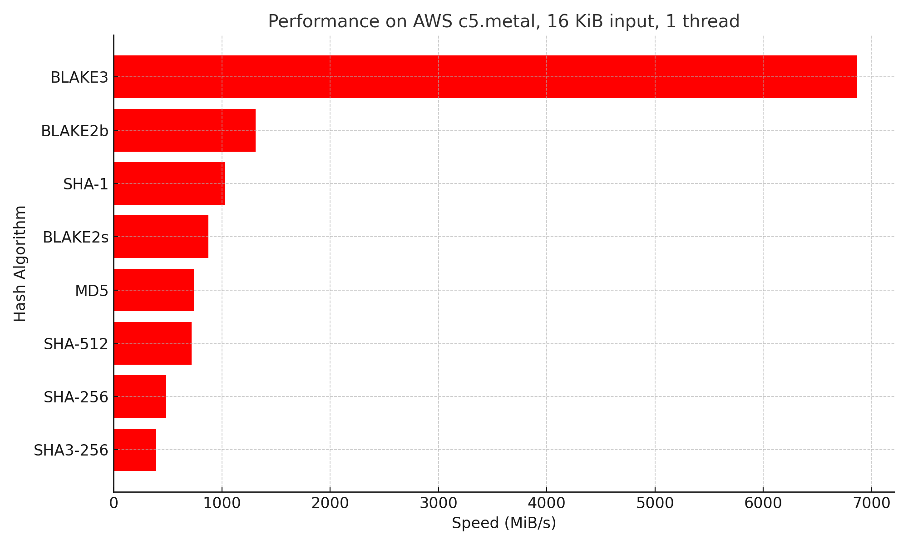

# Storing, compressing and hashing objects

Every bucket stores objects in a storage directory. The objects are compressed and hashed before being stored. The hash is used as the filename of the object and is stored in a directory named after the first 4 characters of the hash. The remaining characters are used as the filename.

## Compression algorithm
For compression, we use zstd. It is a fast compression algorithm with a good compression ratio. It is faster than zlib and has a better compression ratio.

| Compressor name | Ratio | Compression | Decompress. |
| --- | --- | --- | --- |
| **zstd 1.5.1 -1** | 2.887 | 530 MB/s | 1700 MB/s |
| [zlib](https://www.zlib.net/) 1.2.11 -1 | 2.743 | 95 MB/s | 400 MB/s |

Zstandard Compression RFC: [RFC8878](https://datatracker.ietf.org/doc/html/rfc8878)

[Zstd C reference implementation](https://github.com/facebook/zstd)

Buckets uses the [zstd-rs](https://github.com/gyscos/zstd-rs) for compression and decompression, which is a wrapper around the C implementation. A [pure Rust zstd decoder](https://github.com/KillingSpark/zstd-rs) is also available but is slower than the C implementation used by zstd-rs.

## Hash function
For hashing Buckets uses BLAKE3. BLAKE3 is a cryptographic hash function that is much faster than MD5, SHA-1, SHA-2, SHA-3, and BLAKE2. It is secure, highly parallelizable, and capable of verified streaming and incremental updates. It is a PRF, MAC, KDF, and XOF, as well as a regular hash. It is one algorithm with no variants, which is fast on x86-64 and also on smaller architectures.

[Official BLAKE3 implementation](https://github.com/BLAKE3-team/BLAKE3/)
